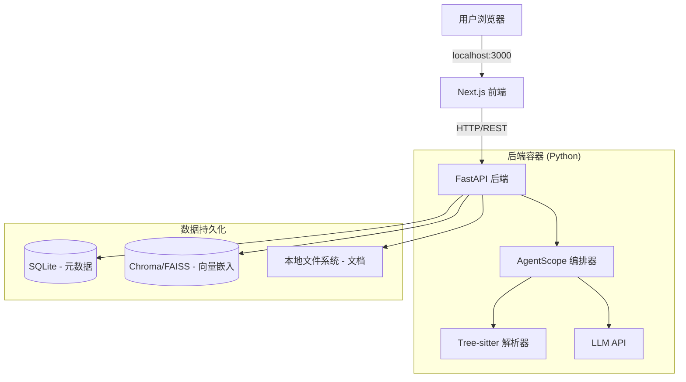

# AutoWiki

**智能代码知识库生成平台**

AutoWiki 是一款企业级的智能代码知识库生成平台。它通过连接 Git 仓库，结合 AST（抽象语法树）解析与 LLM（大语言模型）语义分析，将晦涩的代码库转化为结构清晰、可视化且具有交互性的 Wiki 文档。

## 🚀 核心特性

-   **实时同步 (Living Documentation):** 集成 Webhook，确保文档随代码提交即时更新。
-   **可视化智能 (Visual Intelligence):** 自动生成 Mermaid.js 架构图、时序图和实体关系图（ER 图）。
-   **可控生成 (Steerable Generation):** 支持 `.autowiki.json` 配置文件，允许人工定义文档结构和生成优先级。
-   **Agentic RAG:** 内置 AI 助手，支持“与代码库对话”，提供多步推理和精确的代码引用。
-   **本地化与自托管:** 设计为通过 Docker 在本地或私有云运行，确保数据隐私和安全。

## 🏗 系统架构

AutoWiki 采用微服务架构，由 Next.js 前端和 FastAPI 后端组成，通过 Docker Compose 进行容器化编排。



## 🛠 技术栈

-   **前端:** Next.js 15, Tailwind CSS, TypeScript
-   **后端:** Python (FastAPI), AgentScope
-   **解析层:** Tree-sitter (AST 静态分析)
-   **数据库:** SQLite (元数据), ChromaDB (向量搜索)
-   **基础设施:** Docker Compose

## 🏁 快速开始

### 前置条件

-   [Docker](https://www.docker.com/get-started) & Docker Compose
-   [Git](https://git-scm.com/)

### 安装步骤

1.  **克隆仓库:**

    ```bash
    git clone https://github.com/yourusername/Auto-Wiki.git
    cd Auto-Wiki
    ```

2.  **配置环境变量:**

    在根目录下创建 `.env` file（或确保后端/前端配置已就绪）。你需要提供 LLM 服务商（如 Google Gemini, OpenAI）的 API Key。

    ```bash
    # 示例 .env 配置
    export GOOGLE_API_KEY="你的API密钥"
    ```

3.  **使用 Docker Compose 启动:**

    ```bash
    docker-compose up --build
    ```

4.  **访问应用:**

    -   **前端界面:** 打开 [http://localhost:3000](http://localhost:3000)
    -   **后端 API 文档:** 打开 [http://localhost:8000/docs](http://localhost:8000/docs)

### 本地开发与测试

用于在不使用 Docker 的情况下进行本地开发、调试或运行测试。

#### 前置条件

-   [Node.js](https://nodejs.org/) (v18+)
-   [uv](https://github.com/astral-sh/uv) (快速的 Python 包管理工具)

#### 1. 后端 (Backend)

我们使用 `uv` 进行依赖管理。

**安装与运行:**

```bash
cd backend

# 创建虚拟环境并安装依赖
uv venv
source .venv/bin/activate  # Windows 用户: .venv\Scripts\activate
uv pip install -r requirements.txt

# 启动服务器
uvicorn app.main:app --reload --port 8000
```

**运行测试:**

```bash
# 运行所有测试
pytest

# 运行指定测试文件
pytest tests/test_parser.py
```

#### 2. 前端 (Frontend)

**安装与运行:**

```bash
cd frontend

# 安装依赖
npm install

# 启动开发服务器
NEXT_PUBLIC_API_URL=http://localhost:8000 npm run dev
```

**生产环境构建:**

```bash
npm run build
npm start
```

## 📖 相关文档

更多详细信息，请参阅 `docs/` 目录下的文档：

-   [产品需求文档 (PRD)](docs/PRD-AutoWiki-MVP-CN.md)
-   [技术设计文档](docs/TechDesign-AutoWiki-MVP-CN.md)

## 📄 许可证

本项目采用 Apache License 2.0 许可证 - 详情请参阅 [LICENSE](LICENSE) 文件。
