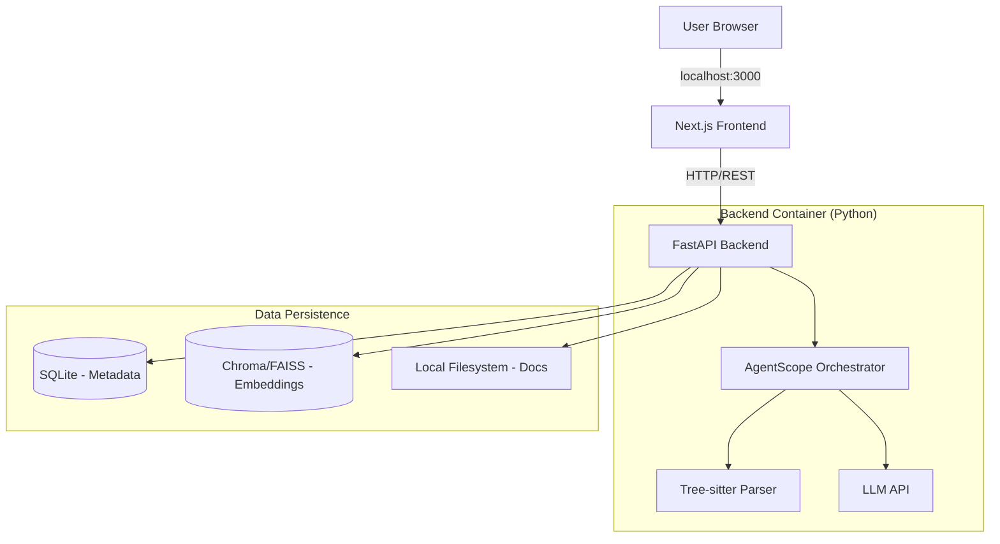

# AutoWiki

**Intelligent Code Knowledge Base Generator**

AutoWiki is an enterprise-grade intelligent code knowledge base generation platform. It transforms obscure codebases into structured, visual, and interactive Wikis by connecting to Git repositories and utilizing a combination of AST (Abstract Syntax Tree) parsing and LLM semantic analysis.

## 🚀 Key Features

-   **Living Documentation:** Integrated Webhooks ensure documentation is updated immediately with code commits.
-   **Visual Intelligence:** Automatically generates Mermaid.js architecture diagrams, sequence diagrams, and ER diagrams.
-   **Steerable Generation:** Supports `.autowiki.json` configuration files, allowing human control over documentation structure and priorities.
-   **Agentic RAG:** Built-in AI assistant for "Chat with Codebase," supporting multi-step reasoning and precise citations.
-   **Local & Self-Hosted:** Designed to run locally or on-premise using Docker, ensuring data privacy.

## 🏗 Architecture

AutoWiki adopts a microservices architecture orchestrating a Next.js frontend and a FastAPI backend, fully containerized with Docker.



## 🛠 Tech Stack

-   **Frontend:** Next.js 15, Tailwind CSS, TypeScript
-   **Backend:** Python (FastAPI), AgentScope
-   **Parsing:** Tree-sitter (AST Analysis)
-   **Database:** SQLite (Metadata), ChromaDB (Vector Search)
-   **Infrastructure:** Docker Compose

## 🏁 Getting Started

### Prerequisites

-   [Docker](https://www.docker.com/get-started) & Docker Compose
-   [Git](https://git-scm.com/)

### Installation

1.  **Clone the repository:**

    ```bash
    git clone https://github.com/yourusername/Auto-Wiki.git
    cd Auto-Wiki
    ```

2.  **Set up Environment Variables:**

    Create a `.env` file in the root directory (or ensure backend/frontend configs are set). You will likely need an API Key for the LLM provider (e.g., Google Gemini, OpenAI).

    ```bash
    # Example .env setup (if applicable)
    export GOOGLE_API_KEY="your_api_key_here"
    ```

3.  **Run with Docker Compose:**

    ```bash
    docker-compose up --build
    ```

4.  **Access the Application:**

    -   **Frontend:** Open [http://localhost:3000](http://localhost:3000)
    -   **Backend API Docs:** Open [http://localhost:8000/docs](http://localhost:8000/docs)

### Local Development & Testing

For development, debugging, or running tests locally without Docker.

#### Prerequisites

-   [Node.js](https://nodejs.org/) (v18+)
-   [uv](https://github.com/astral-sh/uv) (Fast Python package installer and resolver)

#### 1. Backend (Python)

We use `uv` for dependency management.

**Setup & Run:**

```bash
cd backend

# Create virtual environment and install dependencies
uv venv
source .venv/bin/activate  # On Windows: .venv\Scripts\activate
uv pip install -r requirements.txt

# Run the server
uvicorn app.main:app --reload --port 8000
```

**Run Tests:**

```bash
# Run all tests
pytest

# Run specific test file
pytest tests/test_parser.py
```

#### 2. Frontend (Next.js)

**Setup & Run:**

```bash
cd frontend

# Install dependencies
npm install

# Run development server
NEXT_PUBLIC_API_URL=http://localhost:8000 npm run dev
```

**Production Build:**

```bash
npm run build
npm start
```

## 📖 Documentation

For more detailed information, please refer to the documentation in the `docs/` folder:

-   [Product Requirements Document (PRD)](docs/PRD-AutoWiki-MVP.md)
-   [Technical Design Document](docs/TechDesign-AutoWiki-MVP.md)

## 📄 License

This project is licensed under the Apache License 2.0 - see the [LICENSE](LICENSE) file for details.
