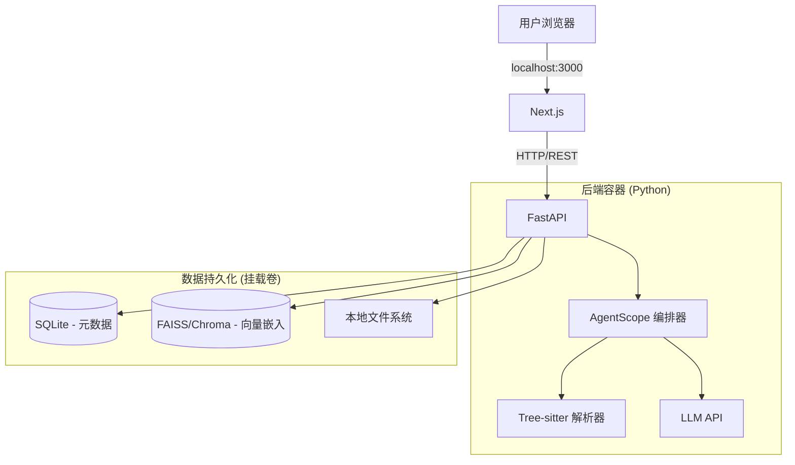

# 技术设计文档: AutoWiki MVP (本地/自托管版)

## 🛠 我们将如何构建 (How We'll Build It)

### 推荐方案："透明盒" Vibe-Coding (Glass Box Vibe-Coding)

鉴于您要构建的是一个复杂的系统（涉及 AST 语法树解析 + Agent 智能体），但又希望采用 "Vibe-code"（AI 辅助编程）的方式，我们需要一套既能屏蔽底层样板代码，又能暴露核心逻辑的方案。

**🏆 首选推荐工具: 首选推荐工具: Gemini CLI (搭配 Gemini 3 Pro 模型)**
* **为什么它最适合 AutoWiki:** Gemini 3 Pro 拥有巨大的上下文窗口（1M+ token），能够一次性读取整个代码库的结构，非常适合处理 AutoWiki 的全局架构分析任务。
* **"架构师"工作流:** 您将在终端使用 Gemini CLI。例如：gemini "读取 backend 目录下的所有文件，编写一个 Tree-sitter 解析脚本"。您将审查 CLI 输出的代码块，然后将其重定向或复制到文件中。
* **成本:** $20/月 (Pro 版) + 您构建 Agent 所需的 API 费用。

## 🏗 系统架构 (Docker化)

由于这是一个本地应用，我们将使用 **Docker Compose** 一键启动整套服务。这确保了您的用户无需手动安装 Python、Node 或 向量数据库。



## 📋 项目启动清单 (Project Setup Checklist)

### 第 1 步：工具准备 (第 1 天)
- [ ] 安装 Gemini CLI 工具 (例如通过 ```pip install google-generativeai``` 或官方 CLI 工具)。
- [ ] 获取 Google AI Studio API Key 并配置环境变量 ```GOOGLE_API_KEY```
- [ ] 初始化: 在终端运行: ```gemini "为 Next.js 15 和 FastAPI 项目生成标准的目录结构命令"```，然后执行生成的命令。

### 第 2 步：仓库结构 (第 1 天)

让 VSCode 运行以下命令：

```bash
# 创建项目结构
mkdir autowiki && cd autowiki
mkdir -p frontend backend/app data
touch docker-compose.yml
```

### 第 3 步："骨架"初始化 (第 2 天)

我们将提示 VSCode 先构建容器，这样您就能立即拥有一个正在运行（虽是空白）的应用。

**给 VSCode 的提示词 (Prompt)**:

```
"我正在构建一个自托管应用程序，包含 Next.js 前端和 FastAPI 后端。请编写一个 docker-compose.yml 将它们连接起来。前端运行在 3000 端口，后端运行在 8000 端口。并为每个服务创建基础的 Dockerfile。"
```

## 🏗 构建核心功能

### 功能 1：数据摄入管道 (最难的部分)

**复杂度**: ⭐⭐⭐⭐⭐ (高)

**依据 PRD**: "使用 Tree-sitter 提取代码骨架... 使用 LLM 生成语义化解释。"

**实施策略**: 不要让 AI 一次性“构建整个解析器”，这通常会失败。请按以下步骤拆解：

1. 步骤 A (Tree-sitter 设置):
    * 提示词: "创建一个使用 tree_sitter 库的 Python 脚本 parser.py。它应接受一个文件路径，检测它是 Python 还是 TypeScript，并打印出 AST（抽象语法树）。"

2. 步骤 B (分块/Chunking):
    * 提示词: "更新 parser.py 以遍历 AST。提取所有的函数定义和类名。将它们作为包含 'code' (代码) 和 'metadata' (元数据) 字段的 JSON 对象返回。"

3. 步骤 C (向量存储):
    * 提示词: "创建 storage.py。使用 chromadb (最适合本地)。编写一个详细的函数 save_chunks，接收步骤 B 中的 JSON 并将其保存到本地持久化的 Chroma DB 中。"

### 功能 2："可操控"配置 (The "Steerable" Config)

**复杂度**: ⭐⭐ (低)

**依据 PRD**: 支持 ```.autowiki.json``` 配置文件。

**实施策略**:

* 提示词: "在 config.py 中创建一个 Pydantic 模型，以匹配此 JSON Schema：[粘贴 PRD 中的 Schema]。添加一个函数，在目标仓库根目录中查找 ```.autowiki.json``` 并进行解析。"

### 功能 3：前端仪表盘 (Frontend Dashboard)

**复杂度**: ⭐⭐⭐ (中) 

**依据 PRD**: 深色模式 (Dark Mode)，项目卡片，类似 "DeepWiki" 的风格。

**实施策略**:

* 提示词: "我需要一个使用 Tailwind CSS 的仪表盘页面。它应该使用深色主题 (slate-900)。创建一个'项目卡片'的网格布局。每个卡片显示标题、描述和'最后更新'徽章。目前先使用模拟数据 (Mock data)。"

### 功能 4：AST 依赖图谱与图存储

**复杂度**: ⭐⭐⭐⭐ (中高)

**依据 PRD**: "根据 AST 结果生成依赖图谱... 存储到本地嵌入式图数据库或文件系统。"

**实施策略**:
使用轻量级的内存图构建方案（如 **NetworkX**）并序列化为 JSON/GML 进行本地存储。这避免了在 MVP 阶段引入沉重的图数据库依赖，但设计必须考虑到未来扩展到嵌入式图数据库（如 **KuzuDB**）或服务器级图数据库（如 **Neo4j**）的可能性。

1. **步骤 A (图模型设计):**
    * 提示词: "创建一个图服务模块。定义图结构，其中节点代表文件(File)、类(Class)和函数(Function)。边代表 `DEFINES` (定义), `INHERITS` (继承), 和 `IMPORTS` (引用) 等关系。"

2. **步骤 B (解析器增强):**
    * 提示词: "更新 AST 解析器以提取 `imports` 语句和 `inheritance` (继承) 关系。将此结构数据与代码块一起返回。"

3. **步骤 C (图构建与存储):**
    * 提示词: "实现一个更新依赖图谱的函数。它应添加解析结果中的节点，并解析导入路径以在文件节点之间创建 `IMPORTS` 边。确保图谱被持久化到本地数据目录。"

### 功能 5：智能搜索与代码地图 (RAG + Graph)

**复杂度**: ⭐⭐⭐⭐⭐ (高)

**依据 PRD**: "自顶向下的代码地图视图... 结合结构重要性的语义搜索。"

**实施策略**:
我们不再返回简单的扁平搜索结果列表，而是实现一种“代码地图 RAG”方法。这涉及到构建一个按重要性排序的模块层次树，并在该上下文中展示搜索结果。

1.  **步骤 A (图分析与重要性):**
    *   提示词: "增强 `GraphService` 以计算节点重要性 (PageRank 或入度中心性)。创建一个方法将每个文件分配到概念层级 (0: 文档, 1: API 入口, 2: 核心服务, 3: 工具/数据)。"
2.  **步骤 B (层次树生成):**
    *   提示词: "实现 `build_module_tree` 函数。它应该遍历文件系统，但根据依赖图（拓扑排序或重要性分数）对兄弟节点进行排序。将其序列化为 `tree.json`。"
3.  **步骤 C (混合搜索服务):**
    *   提示词: "创建 `SearchService`，执行向量搜索以获取'命中点'，然后将这些命中点覆盖到模块树上。将'激活'状态向上传播到父文件夹。返回修剪后的树结构 JSON 给前端。"
4.  **步骤 D (前端代码地图):**
    *   提示词: "在 React 中构建 `CodemapTree` 组件。它应该将搜索结果可视化为交互式树，高亮显示相关路径，并允许用户从 文档 -> API -> 实现 进行向下钻取。"

## 🤖 AI 辅助与审计策略

### 如何审计代码 (您的"架构师"角色)

既然您希望理解系统，请在 Gemini CLI 生成代码之后，使用以下提示词进行“质询”：

1. "五岁小孩也能懂"的审计:
    * "解释一下 ```parser.py``` 是如何处理用户代码中的语法错误的。它是会让整个应用崩溃，还是仅仅跳过该文件？"
2. 安全审计:
    * "审查 ```routes.py```。既然这是本地运行的，我们是否暴露了任何可能允许恶意网站通过 CSRF 窃取用户代码的端点？请添加 CORS 保护。"
3. 逻辑检查:
    * "你使用了简单的字符分割来处理代码分块。PRD 要求基于 AST 的'智能分块'。请重构 ```chunker.py```，严格按照函数/类的边界进行分割。"

## 🚀 部署 (分发)

由于这是一个自托管应用，您的“部署”实际上就是分发 ```docker-compose.yml``` 文件。

1. 用户体验: 用户克隆您的仓库 -> 运行 ```docker-compose up``` -> 打开 ```localhost:3000```。
2. 更新: 用户执行 ```git pull``` -> ```docker-compose up --build```。

## 💰 成本分析 (本地/自托管)

| 资源 | 成本  | 备注 |
| :---- | :---- | :---- |
| **托管 (Hosting)** | $0 | 运行在用户自己的机器上 |
| **向量数据库** | $0 | 本地运行 (Chroma/FAISS) |
| **开发工具** | $20/月 | VSCode + Gemini插件 |
| **LLM API** | 可变 | 开发测试时付费。用户在应用设置中填入自己的 API Key，由用户付费 |

关键决策: 对于 MVP 版本，不要通过您的服务器代理 LLM 调用。请在“设置”页面要求用户输入他们自己的 OpenAI/Anthropic Key。这能将您的运营成本保持在 $0。

## ⚠️ 风险与局限性

* Docker 性能: 在用户的笔记本电脑（尤其是旧电脑）上同时运行 LLM 编排 + 向量数据库 + Next.js 可能会很重。
    * 缓解措施: 在设置中添加“低资源模式”，禁用后台自动重新索引。

* 上下文窗口限制: 解析巨大的 Monorepo (单体仓库) 可能会让用户的 API 成本激增。
    * 缓解措施: 严格实现 PRD 中提到的 "Ignore Patterns" (忽略模式/白名单机制)。

## ✅ 成功检查清单

- [ ] Docker 正常: docker-compose up 能在全新的机器上无报错启动。
- [ ] 摄入正常: 我可以将其指向一个本地 Git 仓库，它能提取代码结构。
- [ ] Wiki 生成: 它能生成实际描述代码逻辑的 Markdown 文件。
- [ ] UI 整洁: “深色模式”看起来很专业，没有明显的样式破损。