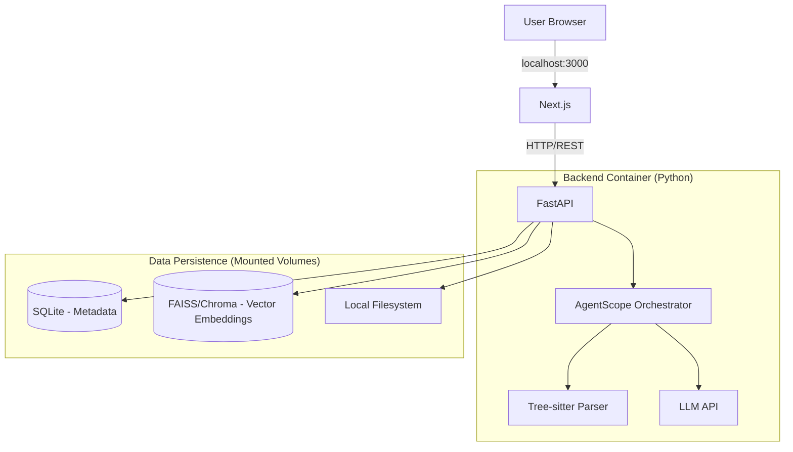

# Technical Design Document: AutoWiki MVP (Local/Self-hosted Version)

## 🛠 How We'll Build It

### Recommended Approach: "Glass Box" Vibe-Coding

Given that you are building a complex system (involving AST syntax tree parsing + Agent entities) but wish to adopt a "Vibe-code" (AI-assisted programming) approach, we need a solution that shields underlying boilerplate code while exposing the core logic.

**🏆 Preferred Tool: Gemini CLI (paired with Gemini 3 Pro Model)**

* **Why it suits AutoWiki best:** Gemini 3 Pro possesses a massive context window (1M+ tokens), enabling it to read the entire codebase structure at once, which is perfect for AutoWiki's global architecture analysis tasks.
* **The "Architect" Workflow:** You will work in the terminal using the Gemini CLI. For example: `gemini "Read all files in the backend directory and write a Tree-sitter parsing script"`. You will review the code blocks output by the CLI, then redirect or copy them into files.
* **Cost:** $20/month (Pro version) + API fees required for building your Agents.

## 🏗 System Architecture (Dockerized)

Since this is a local application, we will use **Docker Compose** to launch the entire suite of services with one click. This ensures your users do not need to manually install Python, Node, or Vector Databases.



## 📋 Project Setup Checklist

### Step 1: Tool Preparation (Day 1)

* [ ] Install Gemini CLI tool (e.g., via `pip install google-generativeai` or the official CLI tool).
* [ ] Get a Google AI Studio API Key and configure the environment variable `GOOGLE_API_KEY`.
* [ ] Initialization: Run in terminal: `gemini "Generate standard directory structure commands for a Next.js 15 and FastAPI project"`, then execute the generated commands.

### Step 2: Repository Structure (Day 1)

Let VSCode run the following commands:

```bash
# Create project structure
mkdir autowiki && cd autowiki
mkdir -p frontend backend/app data
touch docker-compose.yml

```

### Step 3: "Skeleton" Initialization (Day 2)

We will prompt VSCode to build the containers first, so you immediately have a running (albeit blank) application.

**Prompt for VSCode**:

```
"I am building a self-hosted application containing a Next.js frontend and a FastAPI backend. Please write a docker-compose.yml to connect them. The frontend runs on port 3000, and the backend runs on port 8000. Also, create basic Dockerfiles for each service."

```

## 🏗 Building Core Features

### Feature 1: Data Ingestion Pipeline (The Hardest Part)

**Complexity**: ⭐⭐⭐⭐⭐ (High)

**Basis (PRD)**: "Use Tree-sitter to extract code skeleton... Use LLM to generate semantic explanations."

**Implementation Strategy**: Do not let AI "build the entire parser" at once, as this usually fails. Break it down into the following steps:

1. **Step A (Tree-sitter Setup):**
* Prompt: "Create a Python script `parser.py` using the `tree_sitter` library. It should accept a file path, detect if it is Python or TypeScript, and print the AST (Abstract Syntax Tree)."


2. **Step B (Chunking):**
* Prompt: "Update `parser.py` to traverse the AST. Extract all function definitions and class names. Return them as JSON objects containing 'code' and 'metadata' fields."


3. **Step C (Vector Storage):**
* Prompt: "Create `storage.py`. Use `chromadb` (best for local use). Write a detailed function `save_chunks` that receives the JSON from Step B and saves it into a locally persisted Chroma DB."


### Feature 2: "Steerable" Config

**Complexity**: ⭐⭐ (Low)

**Basis (PRD)**: Support `.autowiki.json` configuration file.

**Implementation Strategy**:

* Prompt: "Create a Pydantic model in `config.py` to match this JSON Schema: [Paste Schema from PRD]. Add a function to look for `.autowiki.json` in the target repository root and parse it."

### Feature 3: Frontend Dashboard

**Complexity**: ⭐⭐⭐ (Medium)

**Basis (PRD)**: Dark Mode, Project Cards, style similar to "DeepWiki".

**Implementation Strategy**:

* Prompt: "I need a dashboard page using Tailwind CSS. It should use a dark theme (slate-900). Create a grid layout for 'Project Cards'. Each card shows a title, description, and 'Last Updated' badge. Use mock data for now."

## 🤖 AI Assistance & Audit Strategy

### How to Audit Code (Your "Architect" Role)

Since you want to understand the system, please "interrogate" the code generated by Gemini CLI using the following prompts:

1. **"ELI5" (Explain Like I'm 5) Audit:**
* "Explain how `parser.py` handles syntax errors in user code. Does it crash the whole app or just skip that file?"


2. **Security Audit:**
* "Review `routes.py`. Since this runs locally, are we exposing any endpoints that might allow malicious websites to steal user code via CSRF? Please add CORS protection."


3. **Logic Check:**
* "You used simple character splitting for code chunking. The PRD requires AST-based 'smart chunking'. Please refactor `chunker.py` to split strictly according to function/class boundaries."


## 🚀 Deployment (Distribution)

Since this is a self-hosted application, your "deployment" is actually distributing the `docker-compose.yml` file.

1. **User Experience:** User clones your repo -> runs `docker-compose up` -> opens `localhost:3000`.
2. **Updates:** User executes `git pull` -> `docker-compose up --build`.

## 💰 Cost Analysis (Local/Self-hosted)

| Resource | Cost | Notes |
| --- | --- | --- |
| **Hosting** | $0 | Runs on the user's own machine |
| **Vector Database** | $0 | Runs locally (Chroma/FAISS) |
| **Dev Tools** | $20/month | VSCode with Gemini Subscription |
| **LLM API** | Variable | Paid during dev testing. User enters their own API Key in settings; user pays. |

**Key Decision:** For the MVP version, do not proxy LLM calls through your server. Require users to enter their own OpenAI/Anthropic Key in the "Settings" page. This keeps your operating costs at $0.

## ⚠️ Risks & Limitations

* **Docker Performance:** Running LLM Orchestration + Vector DB + Next.js simultaneously on a user's laptop (especially older ones) might be heavy.
* *Mitigation:* Add a "Low Resource Mode" in settings to disable background auto-reindexing.


* **Context Window Limits:** Parsing a huge Monorepo might spike the user's API costs.
* *Mitigation:* Strictly implement the "Ignore Patterns" (whitelist mechanism) mentioned in the PRD.


## ✅ Success Checklist

* [ ] **Docker Healthy:** `docker-compose up` starts without errors on a fresh machine.
* [ ] **Ingestion Works:** I can point it to a local Git repository, and it extracts the code structure.
* [ ] **Wiki Generation:** It generates Markdown files that actually describe the code logic.
* [ ] **UI Clean:** "Dark Mode" looks professional with no obvious style breakages.